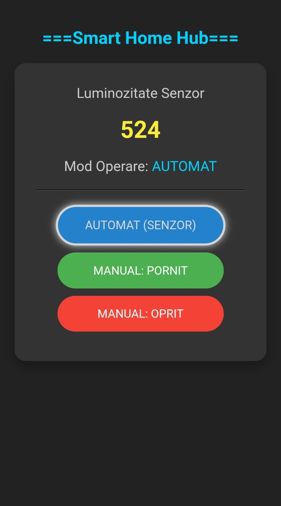

# ESP32 Smart Mini Hub
# Technical Description
IoT implementation of a smart home automation hub designed for the ESP32 NodeMCU platform. This project demonstrates a complete hardware–software embedded system that autonomously regulates lighting based on ambient environmental conditions, integrates remote web-based control, and features real-time status synchronization between the hardware and a client interface.  
<i> Real-Time Responsive Web Dashboard (Mobile View)</i>

# Architecture and logic control
The architecture combines several functional modules, including precision analog sensor acquisition `(ADC)`, a transistor-driven power stage for actuation, an asynchronous web server hosting a Single Page Application `(SPA)`, and a feedback loop utilizing an active buzzer. 
Control logic ties these components together using a Finite State Machine `(FSM)` to ensure deterministic switching between automatic and manual operating modes.

# Objectives
The primary objective was to design a reliable and responsive IoT node capable of: 
* **Dynamic Sensing: Monitoring ambient light levels using a voltage divider circuit with an LDR sensor and high-resolution ADC sampling.**  
* **Hardware Protection: Controlling high-current loads (simulated via LED) using a BJT transistor (2N2222) driver circuit, protecting the microcontroller GPIOs.**  
* **Hybrid Control: Executing seamless mode transitions (Auto/Manual-On/Manual-Off) via both a physical debounced push-button and a remote web interface.**  
* **Telemetry & SPA: Hosting a responsive Web Dashboard directly on the microcontroller, utilizing HTML/CSS for UI and JavaScript (Fetch API/AJAX) for asynchronous bi-directional communication.**  

# System Logic & Hardware
The system's intelligence and reliability are centered around two main engineering assets:
1. Finite State Machine (FSM) Logic
   The system utilizes a deterministic FSM to manage states (AUTO, MANUAL_ON, MANUAL_OFF), ensuring that every transition is uniquely defined by either a physical trigger or a network event.

* Deterministic Behavior: Every state transition is uniquely defined by a single input trigger, preventing race conditions.
* Event-Driven Architecture: Transitions are triggered by asynchronous HTTP requests and synchronized GPIO edge detection.
  
2. Hardware Circuit Design (KiCad)
   Designed with professional EDA standards, the circuit features power integrity measures and robust signal conditioning.

* Power Integrity: Integrated 100nF decoupling capacitors to filter high-frequency noise on the 3.3V rail.  
* Transistor Driver Stage: Dual NPN (2N2222) configuration for both the LED and Buzzer to prevent GPIO current overload.  
* Signal Conditioning: Properly calculated voltage divider for the LDR sensor to maximize ADC resolution.
     

# Skills
This project demonstrates proficiency in:  
**→  `Embedded Systems Programming (C++)` and hardware-software integration.**  
**→  `Analog & Digital Electronics`, including `sensor calibration`, `transistor switching logic` and `signal conditioning`.**    
**→  `Finite State Machine (FSM)` implementation for robust non-blocking system behavior.**  
**→  `Edge-computing logic`, `processing sensor data` locally to make autonomous decisions (Auto Mode).**  
**→  `Network Communication Protocols`, specifically HTTP REST API implementation for command and telemetry transfer.**  
**→  Full-Stack IoT Development, combining `backend logic (ESP32)` with frontend technologies (HTML5, CSS3, JavaScript).**  

# Testing
The final hardware implementation was tested and validated directly on a breadboard prototype, demonstrating accurate `light threshold detection`, instant `web-to-hardware latency response`, stable `Wi-Fi connectivity`, and correct `synchronization between physical inputs and digital status indicators`.

# Key Technologies
`ESP32 SoC`, `Embedded C++`, `KiCad EDA`, `Analog Sensors (LDR)`, `Power Electronics (BJT Transistors)`, `Finite State Machines (FSM)`, `Asynchronous Web Server`, `REST API`, `JavaScript (Fetch/AJAX)`, `HTML5/CSS3`.
